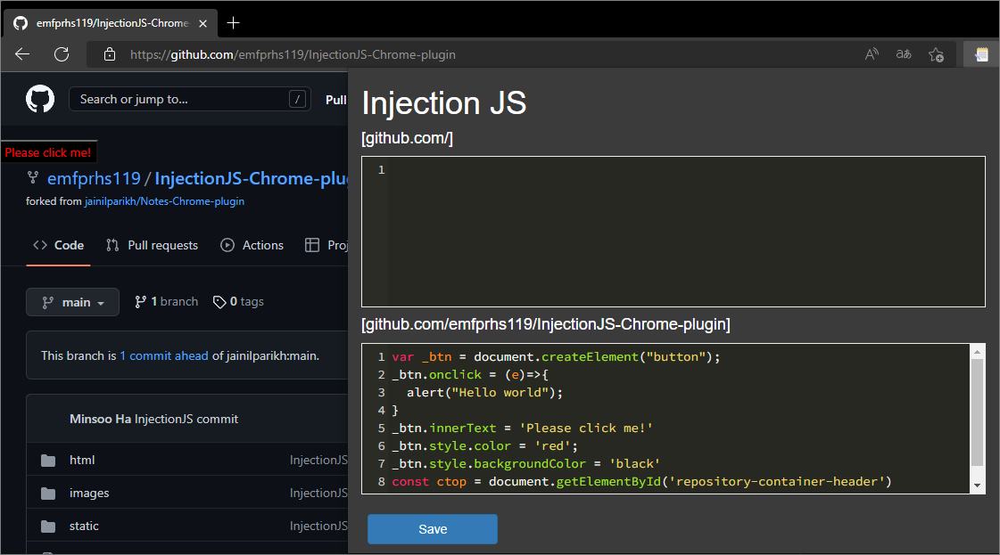

# InjectionJS-Chrome Extension

The purpose of InjectJS is to execute additional code on the loaded page to transform the page or perform additional actions.

Please write the code to be executed after testing it through devTools (F12)

InjectionJS의 목적은 로드된 페이지에서 추가 코드를 실행하여 페이지를 변환하거나 추가 작업을 수행하는 것입니다.

devTools(F12)를 통해 테스트 후 실행할 코드를 작성해주세요.

#### 제공되는 기능은 다음과 같습니다.

- 편집기 제공
- 페이지에 대한 Code 저장 및 자동 불러오기 기능 (baseUrl, targetUrl) / chrome.storage이 사용되었습니다.
- 페이지 로드 후 저장되어있던 코드 실행

#### 추가되면 좋을 것 같은 기능은 다음과 같습니다.

- 스니펫 (자주 쓰는 기능 모음)
- 손쉬운 컴포넌트 인젝션 (예를들어 페이지 위치를 클릭해서 해당 위치에 어떤 컴포넌트를 추가할지 하나씩 대화형으로 선택)

Steps to install:

1.  Open Chrome settings on the top right corner and select Extensions.

2.  Enable developer mode.

3.  Click on load unpacked Extension and select the folder where you have downloaded the git repo.

The extension is now installed and can be seen at chrome://extensions/ .

# Screenshot

# References

- base project : https://github.com/jainilparikh/Notes-Chrome-plugin
